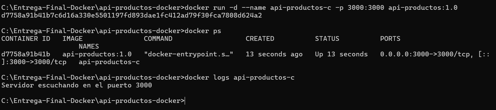
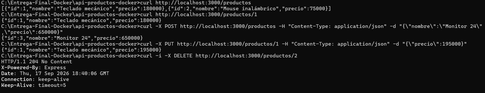
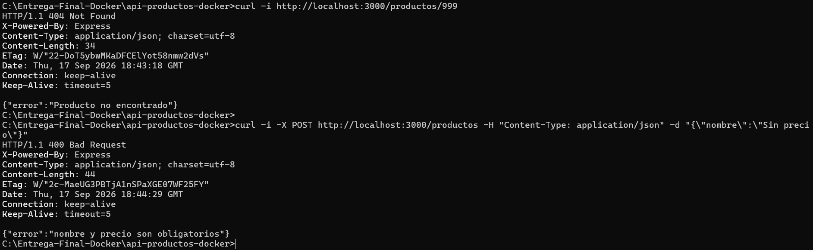
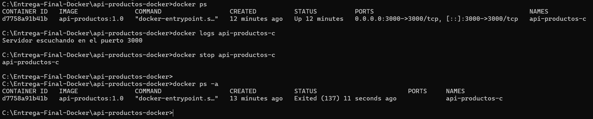

# API de Productos con Docker

Proyecto 1 — Entrega final Docker · Git · GitHub · CI/CD
SENA · Centro de Tecnología y Manufactura Avanzada
Aprendiz: Ismael Mira Correa · Ficha 3229209

## Descripción

API REST de productos para una tienda virtual, empaquetada en una imagen
Docker propia para que pueda ejecutarse en cualquier equipo sin instalar
Node.js. Expone cinco endpoints (CRUD completo) y almacena los datos en
memoria.

| Método | Ruta             | Descripción                  |
|--------|------------------|------------------------------|
| GET    | /productos       | Lista todos los productos    |
| GET    | /productos/:id   | Obtiene un producto por id   |
| POST   | /productos       | Crea un producto             |
| PUT    | /productos/:id   | Actualiza un producto        |
| DELETE | /productos/:id   | Elimina un producto          |

Códigos de estado: 200 (OK), 201 (creado), 204 (eliminado sin contenido),
400 (datos inválidos), 404 (producto no encontrado).

## Requisitos

- Docker Desktop instalado y en ejecución
- Puerto 3000 libre en la máquina anfitriona
- curl o Postman para probar los endpoints

No se requiere Node.js instalado: la aplicación corre dentro del contenedor.

## Ejecución

Construir la imagen:

    docker build -t api-productos:1.0 .

Ejecutar el contenedor en segundo plano:

    docker run -d --name api-productos-c -p 3000:3000 api-productos:1.0

La API queda disponible en http://localhost:3000

Administración del contenedor:

    docker ps                        # listar contenedores en ejecución
    docker ps -a                     # incluir los detenidos
    docker logs api-productos-c      # ver registros
    docker stop api-productos-c      # detener
    docker start api-productos-c     # reiniciar
    docker rm -f api-productos-c     # eliminar el contenedor
    docker rmi api-productos:1.0     # eliminar la imagen

## Imagen vs. contenedor

La **imagen** es una plantilla inmutable y de solo lectura: contiene el
sistema base, las dependencias y el código, en capas. Se construye una vez
con `docker build` y no cambia.

El **contenedor** es una instancia en ejecución de esa imagen. Agrega una
capa de escritura propia, tiene su propio ciclo de vida (creado, en
ejecución, detenido, eliminado) y de una misma imagen se pueden crear
varios contenedores independientes.

En este proyecto, `api-productos:1.0` es la imagen y `api-productos-c` es
el contenedor creado a partir de ella.

## Evidencias

### Imagen construida

La imagen `api-productos:1.0` con nombre y tag propios. Pesa 201 MB en
disco por el uso de la variante `alpine`.

### Endpoints funcionando

Los cinco endpoints del CRUD probados con curl contra el contenedor en
ejecución.

### Manejo de errores

Solicitud de un producto inexistente: responde 404. Creación sin el campo
precio: responde 400.

### Ciclo de vida del contenedor

Al detener el contenedor desaparece de `docker ps` pero sigue listado en
`docker ps -a` con estado `Exited`, y puede reiniciarse con `docker start`.